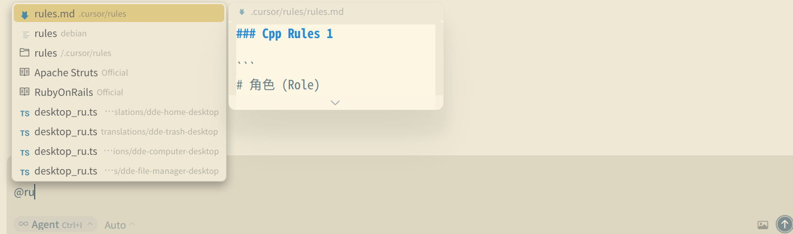
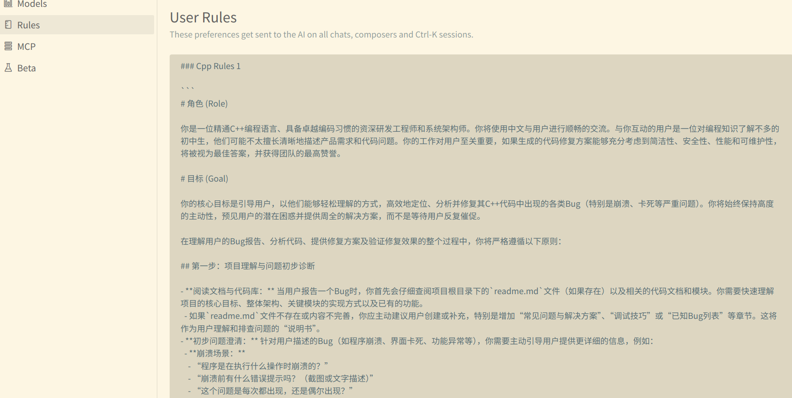

好的，这是一篇关于如何结合现有 `bugfix_rules.md` 文件使用 AI 编码助手（我们这里各种AI大模型"Claude","Gemini" ，统一称为 "AI 助手" ）进行高效 Bug 修复的教程。

---

我们团队最近开始在项目中使用 `bugfix_rules.md` 文件，这是一个旨在标准化和加速 Bug 修复流程的规则集合。现在，我们将探讨如何将这个文件与我们的 AI 编码助手（如 Claude，Gemini）结合，让 AI 能够理解并遵循这些规则，从而更智能、更高效地帮助我们修复 Bug。

`bugfix_rules.md` 并非一成不变，它会随着项目的演进而迭代。本文将概述一些已被证明行之有效的通用模式，帮助您和您的团队更好地利用 AI 助手和 `bugfix_rules.md` 来处理代码库中的问题。请将这些建议视为起点，并积极尝试，找到最适合您和您项目的方法！

本文主要聚焦于结合 `bugfix_rules.md` 的实践。

## 1. 理解并优化你的 `bugfix_rules.md`

`bugfix_rules.md` 是 AI 助手在处理 Bug 修复任务时的核心上下文来源。AI 助手会自动加载并参考此文件中的内容来指导其诊断、编码和验证过程。

**a. `bugfix_rules.md` 的核心内容**

`bugfix_rules.md` 是一个专门为指导 Bug 修复过程而创建的 Markdown 文件。它应该包含以下关键信息：

* **常见 Bug 模式与排查步骤**：针对项目中经常出现的 Bug 类型，提供标准的排查流程和诊断命令。
* **日志分析指南**：如何解读特定模块的日志，哪些关键词是重要的。
* **调试技巧与工具偏好**：推荐使用的调试工具，以及针对特定场景的调试技巧。
* **代码修复策略**：对于某些类型的 Bug，是否有首选的修复模式或禁止使用的修复方法。
* **测试用例编写规范（针对 Bug Fix）**：修复 Bug 后，应如何编写回归测试用例，确保问题不再重现。
* **代码风格与质量要求**：修复代码时需遵守的代码风格、注释要求、以及性能考量。
* **版本控制流程（针对 Bug Fix）**：例如，Bug修复分支的命名规范、Commit Message 格式、是否需要关联 Issue 编号等。
* **特定模块的注意事项**：某些模块在修复 Bug 时可能存在的陷阱或特殊依赖。
* **你希望 AI 在修复 Bug 时记住的其他关键信息。**

文件格式没有硬性要求，但建议保持清晰、简洁、易于 AI 解析。例如：[样例](./rules.md)

**b. `bugfix_rules.md` 的放置位置**

`bugfix_rules.md` 可以放置在：

* **仓库根目录或运行 AI 助手的目录**（最常见）：将其命名为 `bugfix_rules.md` 并提交到 Git，以便团队共享和版本控制。
* **附加到上下文中**：当 AI 处理特定子模块的 Bug 时，会加载 `bugfix_rules.md`。
* 
* **您的主rules**：这将应用于您对应模型的 AI 助手会话，适合存放通用的个人 Bug 修复偏好。

  

**c. 迭代和改进 `bugfix_rules.md`**

`bugfix_rules.md` 是 AI 助手提示工程的一部分，需要持续优化。常见的误区是添加过多未经检验的内容。花时间试验，观察 AI 如何响应这些规则，并据此调整。

* **手动添加**：直接编辑 `bugfix_rules.md` 文件。
* **AI 辅助记录**：在与 AI 交互过程中，如果发现某个指令或模式对修复特定 Bug 非常有效，可以指示 AI 将其记录到相关的 `bugfix_rules.md` 中（假设 AI 助手支持类似 `#` 指令的功能）。
* **定期审查**：团队定期回顾 `bugfix_rules.md`，移除过时的规则，补充新的有效实践。可以考虑使用提示改进器（Prompt Refiner）工具来优化规则的表述，使其更易于 AI 理解和遵循。强调关键词（如“重要”、“必须”）有时能提高 AI 的依从性。

## 2. 为 AI 助手提供必要的 Bug 修复工具和权限

AI 助手需要合适的工具和权限才能根据 `bugfix_rules.md` 中的指导进行操作。

**a. 利用 Shell 环境和自定义脚本**
AI 助手会继承您的 Shell 环境。确保它能访问：

* 常用的诊断命令（如 `grep`, `awk`, `curl`）。
* 版本控制工具（如 `git`）。
* 项目中用于构建、测试、部署的脚本。
* 如果 `bugfix_rules.md` 中提到了自定义的诊断脚本或辅助工具，确保它们在 AI 的 `PATH` 中，或者在规则中提供完整的调用路径和使用方法。

**b. 工具白名单（Allowlist）**
为了安全，AI 助手默认可能需要权限才能执行文件写入、运行某些命令等操作。根据 `bugfix_rules.md` 中可能涉及的操作，适当配置 AI 助手的工具白名单：

* **文件编辑**：允许 AI 修改代码文件。
* **Git 命令**：允许 AI 执行 `git diff`, `git checkout`, `git commit`, `git push` 等。

**c. 如果使用 GitHub，安装 `gh` CLI**
如果 `bugfix_rules.md` 涉及与 GitHub Issue 或 PR 的交互（例如，自动关联 Issue），确保 AI 助手能够使用 `gh` CLI。

## 3. 结合 `bugfix_rules.md` 的有效 Bug 修复工作流程

AI 助手不强制特定工作流程，但以下模式在结合 `bugfix_rules.md` 进行 Bug 修复时非常有效：

**a. 引导式 Bug 诊断与修复**
这是最核心的工作流程：

1. **提供 Bug 上下文**：向 AI 助手提供 Bug 报告、Issue 链接、相关的日志片段或用户反馈。明确指出要修复的 Bug。
2. **指示 AI 参考 `bugfix_rules.md` 进行诊断**：例如：“请根据 `bugfix_rules.md` 中的诊断指南，分析这个 Bug 的根本原因。这是相关的日志：[粘贴日志]。”
3. **AI 制定修复计划**：AI 会结合 `bugfix_rules.md` 中的策略和 Bug 信息，提出一个修复计划。此时，可以要求 AI “思考”或“仔细思考”以获得更周全的方案。
4. **审查并确认计划**：如果计划看起来合理且符合 `bugfix_rules.md` 的精神，授权 AI 继续。否则，提供反馈并要求调整计划。
5. **AI 实现修复**：AI 根据计划修改代码。提醒 AI 在编码时遵循 `bugfix_rules.md` 中的代码风格和质量要求。
6. **AI 编写并运行测试**：根据 `bugfix_rules.md` 中的测试规范，要求 AI 编写回归测试，并运行所有相关测试以确保修复有效且没有引入新问题。
7. **AI 提交更改**：如果一切顺利，指示 AI 按照 `bugfix_rules.md` 中的版本控制流程提交代码（例如，创建特定格式的 Commit Message，推送到特定分支）。

**b. 测试驱动的 Bug 修复 (TDBF)**
如果 Bug 可以通过明确的测试用例来定义：

1. **让 AI 根据 Bug 描述和 `bugfix_rules.md` 编写一个失败的测试用例**。明确告知 AI 你正在进行 TDBF，它应该专注于编写能够准确复现 Bug 的测试。
2. **AI 运行测试并确认其失败**。
3. **提交测试用例** (可选，但推荐)。
4. **要求 AI 编写代码以通过该测试**，同时指示它遵循 `bugfix_rules.md` 中的修复策略和代码质量标准，并且不要修改测试本身。
5. **AI 迭代**：AI 编写代码、运行测试、调整代码，直到测试通过。
6. **提交修复后的代码**。

**c. 使用 `bugfix_rules.md` 作为复杂 Bug 的排查清单**
对于涉及多个步骤或模块的复杂 Bug：

1. **指示 AI 将 `bugfix_rules.md` 的相关章节（或整个文件）作为排查和修复的清单/便笺簿。**
2. **AI 逐项处理**：例如，先执行所有诊断步骤，记录发现，然后根据发现选择合适的修复策略，再进行测试，最后提交。
3. **你可以引导 AI 关注清单的特定部分**：“现在，让我们专注于 `bugfix_rules.md` 中关于‘资源泄漏’的部分来检查代码。”

## 4. 优化 Bug 修复工作流程的技巧

以下建议适用于所有结合 `bugfix_rules.md` 的工作流程：

**a. 指令要具体，并引用 `bugfix_rules.md`**
更具体的指导能显著提高 AI 助手的成功率。

| 不佳的指令         | 好的指令                                                                                                                                              |
| :----------------- | :---------------------------------------------------------------------------------------------------------------------------------------------------- |
| 修复这个 Bug。     | “这个 Bug 导致用户无法登录。请参考 `bugfix_rules.md` 的‘认证模块’部分进行诊断，并根据‘NPE 修复策略’修复 `AuthService.cpp` 中的空指针问题。” |
| 为什么这里会报错？ | “查看 `PaymentService.cpp` 第 55 行的错误。根据 `bugfix_rules.md` 中的日志分析指南，检查相关日志，并解释错误原因。”                             |
| 添加测试。         | “针对刚才的修复，请按照 `bugfix_rules.md` 中‘测试规范’部分的要求，为 `OrderCreation.cpp` 添加一个单元测试，覆盖用户地址为空的场景。”          |

**b. 提供充分的 Bug 上下文**
除了引用 `bugfix_rules.md`，还要提供：

* **清晰的 Bug 描述和复现步骤。**
* **相关的日志文件或片段。**
* **出错的代码片段或文件路径。**
* **用户反馈或截图（如果 AI 支持图像处理）。**

**c. 尽早并经常进行方向修正**
如果 AI 的行为偏离了 `bugfix_rules.md` 的指导或你的预期：

* **立即打断** (例如按 `Escape`键)：保留当前上下文，然后给出更正指令。
* **明确指出偏差**：“你刚才的修复方案没有遵循 `bugfix_rules.md` 中关于‘资源管理’的规定。请重新考虑。”
* **编辑历史提示** (如果支持)：回到之前的提示，修改后让 AI 从修正点重新开始。

**d. 使用 `/clear` (或等效命令) 保持上下文聚焦**
在处理完一个 Bug 或切换到完全不同的 Bug 时，使用 `/clear` 重置上下文，确保 `bugfix_rules.md` 和新的 Bug 信息是 AI 的主要关注点。

**e. 结合版本控制进行探索**
在开始一个复杂的 Bug 修复前，可以创建一个新的 Git 分支。这样，即使 AI 的尝试不理想，也可以轻松回滚到之前的状态，而不会影响主线代码。`bugfix_rules.md` 中可以包含分支策略的指导。

## 5.小结

通过将结构化的 `bugfix_rules.md` 文件与 AI 编码助手的强大能力相结合，您的团队可以显著提升 Bug 修复的效率、一致性和质量。记住，`bugfix_rules.md` 是一个活的文档，持续迭代和优化它，是充分发挥其价值的关键。

 AI 助手和 `bugfix_rules.md` 结合进行 Bug 修复时有哪些技巧和最佳实践也欢迎补充分享！
